# Analysis Pipeline: How detection Works

This document explains the "Magic" behind Sentinel's detection. We use 8 parallel layers of security to ensure no scam slips through.

## The Detection Logic Flow

```mermaid
flowchart TD
    Start([Start Analysis]) --> Fork[Fork Blockchain State]
    Fork --> Parallel{Parallel Analysis Layers}
    
    subgraph "Dynamic Analysis (Running the Code)"
        Parallel --> Time["⏳ Time-Travel Check"]
        Parallel --> Actor["🎭 Privilege Check"]
        Parallel --> Sim["⚡ Execution Simulation"]
    end
    
    subgraph "Static Analysis (Reading the Code)"
        Parallel --> Proxy["🔍 Proxy Inspector"]
        Parallel --> Code["📜 Bytecode Scanner"]
    end
    
    Sim --> Trace["🕵️ Opcode Tracer"]
    
    Parallel -->|Extract Features| Aggregate[Feature Aggregator]
    Aggregate --> ML["🧠 AI Brain (ML Service)"]
    
    ML -->|Risk Probability| Verdict{Final Verdict}
    Aggregate -->|Hard Rules & Flags| Verdict
    
    Verdict -->|High Risk| Block[🔴 BLOCK]
    Verdict -->|Med Risk| Warn[🟡 WARN]
    Verdict -->|Low Risk| Safe[🟢 SAFE]
```

## 1. Local Forked Simulation
**Concept**: "Try before you buy."
Most wallets just ask the blockchain "Will this work?" The blockchain says "Yes" even for scams.
**What We Do**: We download the contract to our own private computer (Local Fork). We run your transaction there first. If it steals your money in our simulation, we warn you before you sign the real one.

## 2. Time-Travel Simulation (The Time Bomb Detector)
**Concept**: "Waiting for the trap to spring."
Scammers often program contracts to work perfectly for 24 hours to build trust, then lock everyone out.
**What We Do**:
*   We fast-forward our private blockchain's clock by **1 Hour**, **1 Day**, **7 Days**, and **30 Days**.
*   We try your transaction again at each time.
*   **Detection**: If it works NOW but fails TOMORROW, it's a **Time Bomb**.

## 3. Counterfactual Analysis (The Privilege Detector)
**Concept**: "Rules for thee, but not for me."
A classic Honeypot allows the *Owner* to sell, but blocks *You* from selling.
**What We Do**:
*   We impersonate the **Contract Owner** in our simulation.
*   We try to sell the token as *You* (Fail?) and then as *The Owner* (Success?).
*   **Detection**: If the Owner has special privileges to trade when you can't, it's a **Honeypot**.

## 4. Opcode Tracing (The Detective)
**Concept**: "Reading the fine print."
While the simulation runs, we watch every single instruction (Opcode) the processor executes.
**What We Do**:
*   We look for specific commands like `SLOAD` (Reading storage) right after `CALLER` (Checking who you are).
*   **Detection**: This pattern usually means "Check if this user is on the whitelist". If found, we flag it as **Restricted Access**.

## 5. Bytecode Analysis (The Fingerprint Scanner)
**Concept**: "Checking the police database."
Malicious functions often look similar.
**What We Do**:
*   We scan the raw code (Bytecode) for known malicious fingerprints (Function Selectors).
*   **Examples**:
    *   `blacklist(address)`: The code literally says it can blacklist you.
    *   `drain()`: A function designed to steal all funds.

## 6. Machine Learning (The Intuition)
**Concept**: "Pattern Recognition."
Some scams are new and don't break hard rules.
**What We Do**:
*   We feed 15 data points (revert rates, gas usage, entropy) into a trained AI model.
*   The AI compares this transaction against 10,000 known scams.
*   **Result**: It gives a probability score (e.g., "98% likely to be a scam").

## 7. Behavioral Drift (The Alarm System)
**Concept**: "Did the lock change?"
A contract might be safe today, but the owner upgrades it to be malicious tomorrow.
**What We Do**:
*   We compare today's scan against the last time we scanned this contract.
*   **Detection**: If the risk score jumps (e.g., from 0 to 100), we alert you to **Sudden Behavioral Drift**.
