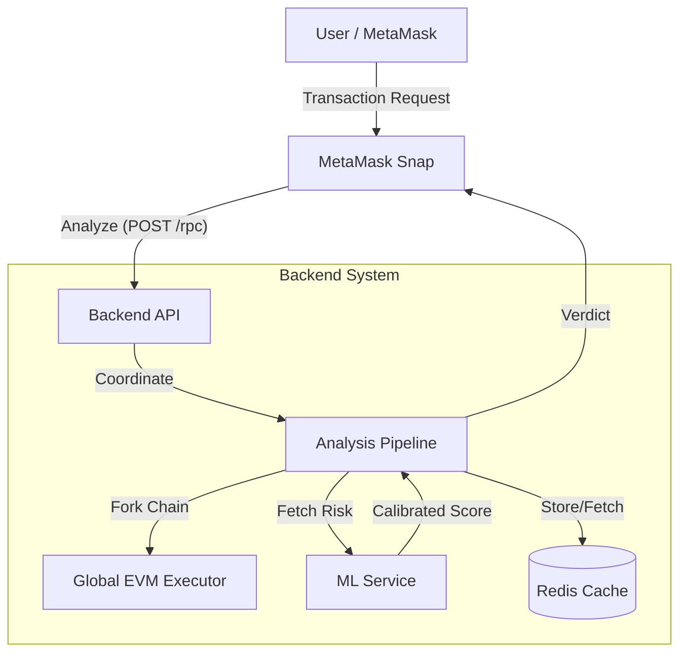

# Crypto Scam Prevention (Sentinel Security)

**Real-time crypto scam detection powered by advanced EVM simulation**

[](https://opensource.org/licenses/MIT)
[](https://nodejs.org/)
[](https://www.typescriptlang.org/)

---

## 👥 Team: TheLastCodeBenders

*   **Saajan P Varghese**: [GitHub](https://github.com/saaj376)
*   **Hari Kishore C**: [GitHub](https://github.com/Hari19hk)
*   **Sukesh S**: [GitHub](https://github.com/ssukesh182)
*   **Harshan J**: [GitHub](https://github.com/HJK21)

---

## 🚀 Overview

**Sentinel Security** protects you from crypto scams by analyzing transactions BEFORE they execute. Get instant warnings about honeypots, time-locked scams, and malicious contracts.

### What We Detect
- 🎣 **Honeypot Contracts**: Tokens you can buy but never sell
- ⏰ **Time-Bomb Scams**: Contracts that work now but fail later
- 👑 **Privilege Abuse**: Owners can trade, but users cannot
- 💸 **Hidden Fees**: Excessive or variable transaction costs
- 🔄 **Behavioral Drift**: Contracts that change behavior over time
- 🎭 **Proxy Deception**: Malicious logic hidden in implementations

---

## 📖 Documentation

We have comprehensive documentation covering every aspect of the system:

*   **[🏛️ System Architecture](Docs/Architecture.md)**: High-level design, components, and diagrams.
*   **[🔬 Analysis Pipeline](Docs/Analysis_Pipeline.md)**: Deep dive into the 8 layers of detection logic.
*   **[⚙️ Setup & Deployment](Docs/Setup_and_Deployment.md)**: Installation guide for Backend, ML, and Snap.
*   **[🔌 API Reference](Docs/API_Reference.md)**: Endpoints for the Backend and ML service.
*   **[👤 User Guide](Docs/User_Guide.md)**: How to use the Snap and interpret results.
*   **[❓ FAQ](Docs/FAQ.md)**: Answers to common and technical questions.

---

## 🌟 Key Features

### 1. Time-Travel Simulation (Industry First)
Tests your transaction at multiple timestamps to detect delayed honeypots:
```
Current Block: ✅ Success
+1 Hour:       ✅ Success
+7 Days:       ❌ REVERTED → 🚨 TIME-BOMB DETECTED
```

### 2. Counterfactual "Who Can Trade?" Analysis
Simulates the SAME transaction from different perspectives:
```
Random User:  ❌ REVERTED
Contract Owner: ✅ SUCCESS → 🚨 HONEYPOT CONFIRMED
```

### 3. Opcode-Level Detective Insights
Traces execution to explain WHY transactions fail:
```
"❌ The contract checked who you are (CALLER) and compared it 
against a stored whitelist (SLOAD). Since you're not on the 
list, it blocked your transaction."
```

### 4. Behavioral Drift Tracking
Monitors contracts over time:
```
"⚠️ Risk increased +40 since last scan 3 days ago"
"New flag: drain() function appeared after proxy upgrade"
```

---

## 🏗️ Architecture



**Technology Stack:**
- **Backend**: Node.js, TypeScript, Express
- **EVM**: @ethereumjs/evm (raw EVM simulation)
- **ML Engine**: Python, XGBoost, Scikit-learn
- **Database**: Redis (scan history)

---

## 🎯 Supported Networks

- Ethereum Mainnet (Chain ID: 1)
- Polygon (Chain ID: 137)
- Optimism (Chain ID: 10)
- Arbitrum (Chain ID: 42161)
- Base (Chain ID: 8453)
- BSC (Chain ID: 56)
- Sepolia Testnet (Chain ID: 11155111)

---

## 🤝 Contributing

We welcome contributions! Please:
1. Fork the repository
2. Create a feature branch
3. Submit a pull request

---

## 📝 License

MIT License - see LICENSE file for details

---

## 🏆 Built For KHacks

This project was developed for the KHacks hackathon to protect users from crypto scams.